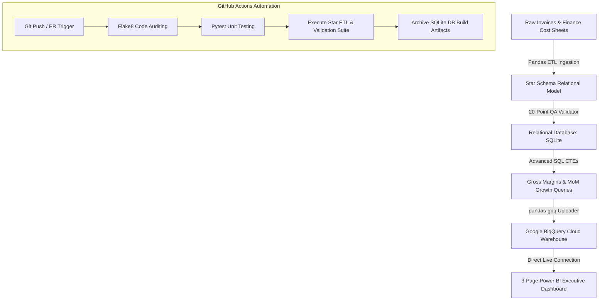
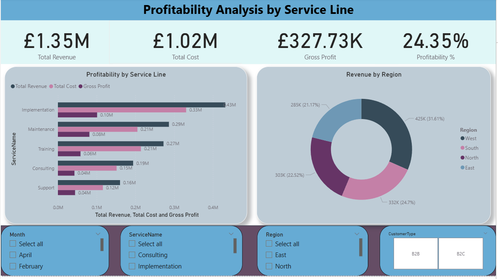
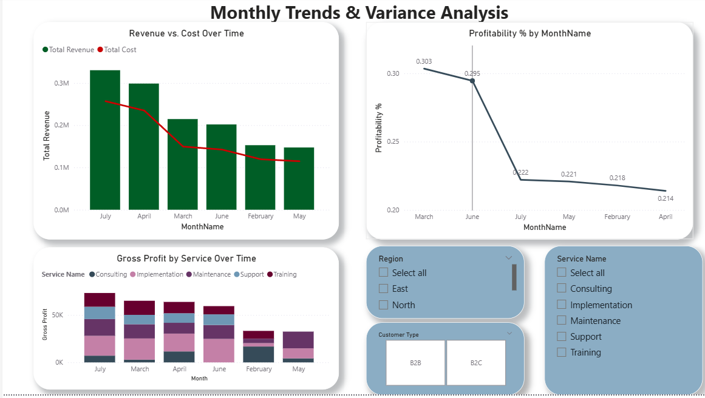
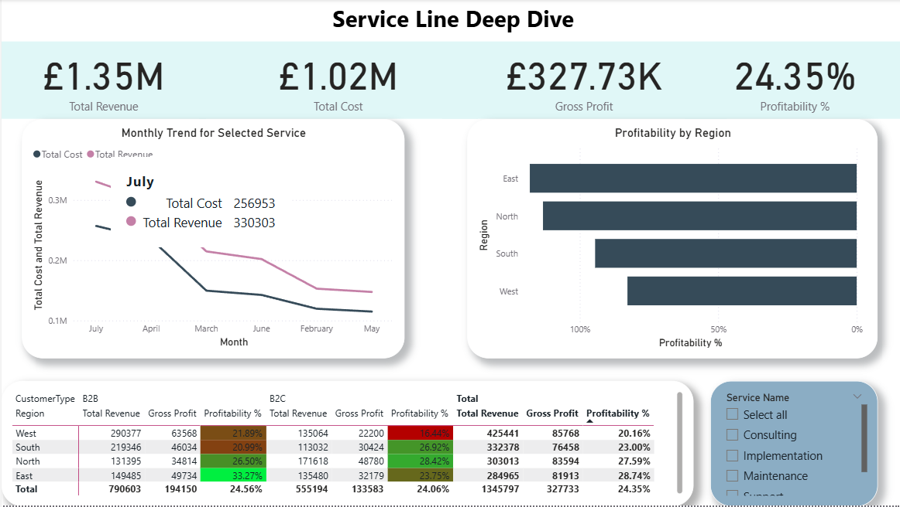

# Corporate Service Profitability Suite: Enterprise Star Schema Data Warehouse & 3-Page Power BI Portal

An end-to-end, production-grade cloud data warehouse and corporate financial intelligence platform. This repository structures high-fidelity service invoicing and monthly overhead cost workbooks under a unified **Star Schema**. It automates transactional ingestion, executes a robust Python ETL pipeline, enforces a 20-point database quality validation suite, automates Google BigQuery cloud warehousing, and delivers a stunning 3-page interactive Dark Slate Power BI dashboard portal showing service margins, revenue-to-cost distributions, and regional segmentation trends.

---

## 🏗️ Technical Architecture & Data Flow



---

## 🛠️ Data Modeling & Relational Schema (Star Schema)

The data warehouse models mixed-grain corporate invoicing transactions and monthly overhead finance spreadsheets under an optimized **Star Schema**:

* **Fact Revenues**: Centralizes invoice billing details (`fact_revenues`) mapped to dates, services, customer categories, and geographical regions.
* **Fact Costs**: Stores monthly corporate overhead expenditures (`fact_costs`) mapped to services.
* **Dimension Tables**: Shares calendar records (`dim_date`), geographic markets (`dim_regions`), client types (`dim_customer_types`), and service lines (`dim_services`).

---

## 📂 Project Structure

```
├── .github/workflows/
│   └── ci_cd.yml                 # Automated testing, linting, & pipeline validation
├── data/
│   ├── raw/                      # Raw synthetic mixed-case & dirty CSVs (generated)
│   ├── processed/                # Cleansed dimension and fact CSVs (star schema)
│   └── profitability.db          # SQLite relational database (indexed)
├── power_bi/
│   ├── images/                   # Dashboard screenshots for GitHub portfolio
│   │   ├── service_profitability_overview.png
│   │   ├── service_revenue_costs.png
│   │   └── service_margins_trends.png
│   └── power_bi_playbook.md      # Power BI Star Schema specifications & DAX measures
├── src/
│   ├── data_generator/
│   │   └── generate_raw_data.py  # Dirty simulated invoicing & cost workbook generator
│   ├── etl/
│   │   ├── etl_pipeline.py       # Casing, date parser, deduplication, & star-schema map
│   │   ├── db_loader.py          # Relational SQLite DDL compiler and table builder
│   │   └── data_validation.py    # 20-point DB quality check class suite
│   └── sql/
│       ├── schema_ddl.sql        # SQLite relational table constraints and indexes
│       ├── margin_analysis.sql   # CTE: Cumulative gross margins by service line
│       ├── mom_variance.sql      # CTE: Monthly revenue growth with lag windows
│       └── regional_segmentation.sql# CTE: Regional client segmentation performance
├── tests/
│   └── test_etl.py               # Pytest unit tests for transforms and validator assertions
├── main.py                       # Master orchestrator entrypoint
├── run_bigquery_analysis.py      # Cloud streaming uploader & BigQuery View creator
├── requirements.txt              # Pipeline package dependencies
├── BEGINNERS_GUIDE.md            # Zero-knowledge step-by-step PowerShell execution guide
└── walkthrough.md                # Detailed operational execution run logs
```

---

## 📈 SQL Analytics & Business Logic

The warehouse compiles highly complex corporate finance reports directly in modular SQL:

### 1. Service Line Gross Margin Ratios (`margin_analysis.sql`)
Aggregates daily transactional service invoice revenue and monthly cost overheads (labor, operational, fixed overhead), reconciles mixed grains, and calculates cumulative gross profit and margins by service line.

### 2. Month-over-Month Profit Variance (`mom_variance.sql`)
Combines monthly revenues and costs and utilizes SQL Window functions (`LAG`) to calculate rolling MoM net profit variance percentages across chronological calendar slots.

### 3. Geographical Billing Segmentation (`regional_segmentation.sql`)
Reconciles corporate billing receipts across regional markets and client types, tracking outstanding invoice days to evaluate collection efficiencies.

---

## 📊 The 3-Page Executive Power BI Dashboard Portal

The business intelligence layer is a highly visual, Dark Glassmorphic Dashboard Portal built directly in Power BI Desktop connected to Google BigQuery:

### Page 1: B2B Service Profitability Overview
* **Visual KPIs**: Cumulative Service Revenue, Total Overhead Costs, Corporate Net Profits, and Profit Margin %.
* **Margin Performance**: Dual-axis trend line mapping rolling service revenues against profit margin ratios by month.
* **Top Service Performers**: Clustered column bars listing net profit generation across all 5 corporate services.
* **Geographical Distribution**: Emerald data bar matrices grouping revenue segments by region and customer class.



---

### Page 2: Service Revenue vs Cost Breakdown
* **Visual KPIs**: Total Revenue, Total Overhead Expense, Total Operational Cost, and Fixed Overhead Fee.
* **Cash Flow Inefficiencies**: A scatter plot matching invoice volumes against monthly cost structures to isolate underperforming service classes.
* **Category Billing Invoices**: Clean tabular list auditing gross invoices and outstanding days by service line.



---

### Page 3: Service Margins & Growth Trends
* **Visual KPIs**: Average Days Outstanding, Outstanding Revenue, Maximum Service Margin %, and MoM Net Variance.
* **Chronological Profit Curves**: Dynamic area chart mapping monthly cash flows across B2B service divisions.
* **Growth Velocity scatter**: Visualizes growth rates by service line, immediately highlighting positive vs. negative margin transitions.



---

## ⚡ Setup & Execution

### 1. Run the local pipelines and validate data:
```bash
python main.py
```

### 2. Execute the test suite:
```bash
python -m pytest tests/ -v
```

### 3. Automate GCP BigQuery Ingestion:
```bash
# Set GCP environment variables
$env:GCP_PROJECT_ID="your-project-id"

# Upload datasets and create analytical views
python run_bigquery_analysis.py
```
