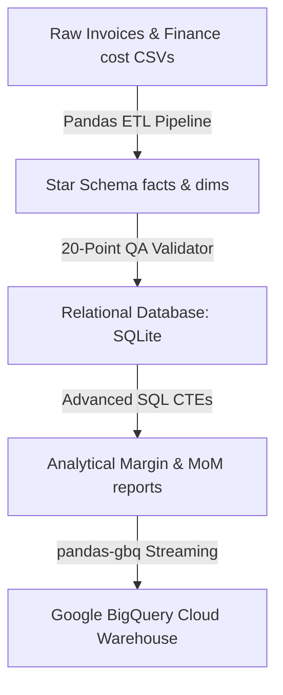

# B2B Corporate Service Profitability Analysis Data Warehouse

An end-to-end, production-grade cloud data warehouse and analytical processing engine. This repository structures a high-fidelity B2B corporate service invoicing and operational finance cost database under a unified **Star Schema**. It automates messy data generation, performs robust Pandas-based ETL standardizations, executes a 20-point relational database quality validation suite, compiles optimized SQLite schemas, and streams all cleaned dimension and fact records directly into Google BigQuery.

---

## 🏗️ Technical Architecture & Data Flow



---

## 📂 Project Structure

```
├── .github/workflows/
│   └── ci_cd.yml                 # Linting, testing, and pipeline execution
├── data/
│   ├── raw/                      # Raw synthetic mixed-case & dirty CSVs
│   ├── processed/                # Cleansed dimension and fact CSVs
│   └── profitability.db          # SQLite relational database (indexed)
├── power_bi/
│   └── power_bi_playbook.md      # Power BI visual specifications & DAX measures
├── src/
│   ├── data_generator/
│   │   └── generate_raw_data.py  # Dirty simulated invoicing & cost workbook generator
│   ├── etl/
│   │   ├── etl_pipeline.py       # Casing, parser, deduplication, & star-schema map
│   │   ├── db_loader.py          # Relational SQLite DDL compiler and table builder
│   │   └── data_validation.py    # 20-point DB quality check class suite
│   └── sql/
│       ├── schema_ddl.sql        # Relational constraints and performance indices
│       ├── margin_analysis.sql   # CTE: Cumulative gross margins by service line
│       ├── mom_variance.sql      # CTE: Monthly revenue growth with lag windows
│       └── regional_segmentation.sql# CTE: Regional client segmentation performance
├── tests/
│   └── test_etl.py               # Pytest unit tests for transforms and validator assertions
├── main.py                       # Master orchestrator entrypoint
├── run_bigquery_analysis.py      # Cloud streaming loader & BigQuery View creator
├── requirements.txt              # Pipeline package dependencies
├── BEGINNERS_GUIDE.md            # Zero-knowledge step-by-step PowerShell execution guide
└── walkthrough.md                # Detailed operational execution run logs
```

---

## ⚡ Execution

### 1. Ingest, Reconcile & Validate Locally:
```bash
python main.py
```

### 2. Run Automated Pytest Suite:
```bash
python -m pytest tests/ -v
```

### 3. Stream to Google BigQuery Cloud Warehouse:
```bash
python run_bigquery_analysis.py
```
